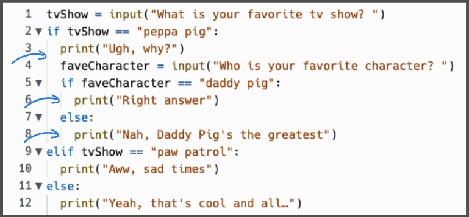

# Nesting
Nesting is where we put an `if` statement within an `if` statement using the power of indenting.
The second `if` statement within the first `if` statement must be indented and its `print` statement needs to be indented one more time. 

  
Pay attention to the vertical lines (as shown with the blue arrows in this image) to ensure your indents line up correctly.




&nbsp;

👉 Do you notice the second `if` statement below about `faveCharacter` and how it is indented?

```python
tvShow = input("What is your favorite tv show? ")
if tvShow == "peppa pig":
  print("Ugh, why?")
  faveCharacter = input("Who is your favorite character? ")
  if faveCharacter == "daddy pig":
    print("Right answer")
  else:
    print("Nah, Daddy Pig's the greatest")
elif tvShow == "paw patrol":
  print("Aww, sad times")
else:
  print("Yeah, that's cool and all…")
```

### I highly doubt your favorite TV shows are Peppa Pig and Paw Patrol. Copy the code above and change it to match your favorite TV shows and characters.

